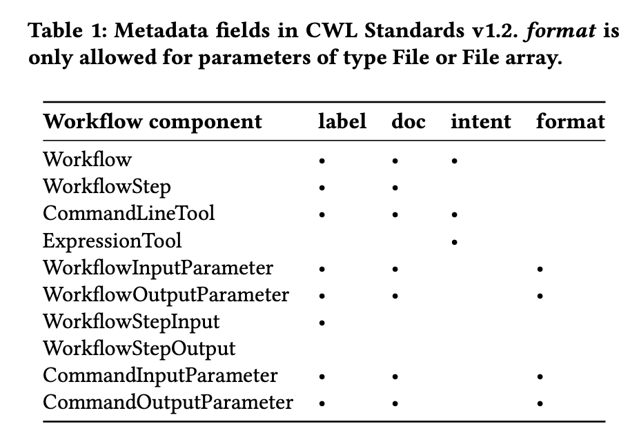
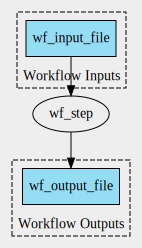

# Scenario 1

Analysis to assess if CWL metadata fields (`label`, `doc`, `intent`, `format`) are propagated to RO-Crate RDF (`ro-crate-metadata.json`) by runcrate 0.5.0. In addition, representation of the human agent that executed the workflow is checked, as well as basename and checksum of the input and output files.

As an example, we use a simple CWL workflow comprising a single step, one input and one output parameter (both File).

- Run the workflow: `cwltool wf.cwl wf_job.yml`
- Create workflow graph: `cwltool --print-dot wf.cwl | dot -Tsvg > wf_graph.svg`
- Create RO: `cwltool --full-name "Renske de Wit" --orcid https://orcid.org/0000-0003-0902-0086 --provenance ./ro wf.cwl wf_job.yml`
- Convert to ROCrate: `runcrate convert ./ro --output ./rocrate`

## Human agent

- Name: [#L251](./rocrate/ro-crate-metadata.json) 
- ORCID ID: [#L249](./rocrate/ro-crate-metadata.json) 

## `label`

`label` fields for Workflow, WorkflowStep, and CommandLineTool are propagated to [ro-crate-metadata.json](./rocrate/ro-crate-metadata.json).

- Workflow ([#L40](./rocrate/packed.cwl)): #L111
- WorkflowStep (#L76): #L164
- CommandLineTool (#L7): #182
- WorkflowInputParameter (#L48): Not propagated
- WorkflowOutputParameter (#L58): Not propagated
- WorkflowStepInput: Not in test workflow
- CommandInputParameter (#L18): Not propagated
- CommandOutputParameter: (#L31): Not propagated

## `doc`

- Workflow ([#L41](./rocrate/packed.cwl)): #L100
- WorkflowStep (#L77): #L163
- CommandLineTool (#L8): #L173
- WorkflowInputParameter (#L49): #L143
- WorkflowOutputParameter (#L59): #L151
- CommandInputParameter (#L19): #L193
- CommandOutputParameter (#L32): #L201 

## `format`

- WorkflowInputParameter ([#L50](./rocrate/packed.cwl)): #L144
- WorkflowOutputParameter (#L60): #L152
- CommandInputParameter (#L20): #L194
- CommandOutputParameter (#L33): #L202 

## `intent`

- Workflow ([#L42-44](./rocrate/packed.cwl)): Not propagated
- CommandLineTool (#L9-11): #L174-176

## File characteristics

- Basename [#L27](./ro/metadata/provenance/primary.cwlprov.ttl): #L292
- Checksum: [#L44](./ro/metadata/provenance/primary.cwlprov.ttl): #L287, #L304