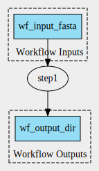

# Scenario 2 

Analysis to assess if the `SoftwareRequirement` field in CWL workflows is propagated to `ro-crate-metadata.json`. 

Single-step workflow. CommandLineTool has 3 parameters:

1. `fasta`: default value defined at WorkflowInputParameter level
2. `script`: default value defined at CommandLineTool input parameter level
3. `outdir`: default value defined at WorkflowStep level.

Output: `./output_directory_name`

- Create CWLProv RO: `cwltool --provenance ./ro wf.cwl`
- Create workflow graph: `cwltool --print-dot wf.cwl | dot -Tsvg > wf_graph.svg`
- Convert to ROCrate: `runcrate convert ./ro --output ./rocrate`

## SoftwareRequirement

`SoftwareRequirement` is not represented in `ro-crate-metadata.json`. 