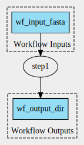

# Scenario 2



Single-step workflow. CommandLineTool has 3 parameters:

1. `fasta`: default value defined at WorkflowInputParameter level
2. `script`: default value defined at CommandLineTool input parameter level
3. `outdir`: default value defined at WorkflowStep level.

Output: `./output_directory_name`

- Create CWLProv RO: `cwltool --provenance ./ro wf.cwl`
- Create workflow graph: `cwltool --print-dot wf.cwl | dot -Tsvg > wf_graph.svg`
- Convert to ROCrate: 

```
(venv) (base) MacBook-van-Renske:scenario2 renskedewit$ runcrate convert ./ro --output ./rocrate
Traceback (most recent call last):
  File "/Users/renskedewit/Documents/GitHub/runcrate/venv/bin/runcrate", line 8, in <module>
    sys.exit(cli())
  File "/Users/renskedewit/Documents/GitHub/runcrate/venv/lib/python3.9/site-packages/click/core.py", line 1130, in __call__
    return self.main(*args, **kwargs)
  File "/Users/renskedewit/Documents/GitHub/runcrate/venv/lib/python3.9/site-packages/click/core.py", line 1055, in main
    rv = self.invoke(ctx)
  File "/Users/renskedewit/Documents/GitHub/runcrate/venv/lib/python3.9/site-packages/click/core.py", line 1657, in invoke
    return _process_result(sub_ctx.command.invoke(sub_ctx))
  File "/Users/renskedewit/Documents/GitHub/runcrate/venv/lib/python3.9/site-packages/click/core.py", line 1404, in invoke
    return ctx.invoke(self.callback, **ctx.params)
  File "/Users/renskedewit/Documents/GitHub/runcrate/venv/lib/python3.9/site-packages/click/core.py", line 760, in invoke
    return __callback(*args, **kwargs)
  File "/Users/renskedewit/Documents/GitHub/runcrate/src/runcrate/cli.py", line 57, in convert
    crate = builder.build()
  File "/Users/renskedewit/Documents/GitHub/runcrate/src/runcrate/__init__.py", line 255, in build
    self.add_workflow(crate)
  File "/Users/renskedewit/Documents/GitHub/runcrate/src/runcrate/__init__.py", line 278, in add_workflow
    self.add_param_connections(crate, workflow)
  File "/Users/renskedewit/Documents/GitHub/runcrate/src/runcrate/__init__.py", line 535, in add_param_connections
    from_param = get_fragment(mapping.source)
  File "/Users/renskedewit/Documents/GitHub/runcrate/src/runcrate/__init__.py", line 111, in get_fragment
    return uri.rsplit("#", 1)[-1]
AttributeError: 'NoneType' object has no attribute 'rsplit'
```
