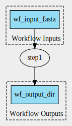

# Scenario 3

Analysis to assess the representation of `DockerRequirement` in `ro-crate-metadata.json`. 

Single-step workflow. CommandLineTool has 3 parameters:

1. `fasta`: default value defined at WorkflowInputParameter level
2. `script`: default value defined at CommandLineTool input parameter level
3. `outdir`: default value defined at **CommandLineTool input parameter level** (in contrast to Scenario2).

Output: `./output_directory_name`

In contrast to Scenario 2, this workflow has a `DockerRequirement` instead of `SoftwareRequirement`.

- Create workflow graph: `cwltool --print-dot wf.cwl | dot -Tsvg > wf_graph.svg`
- Create CWLProv RO: `cwltool --provenance ./ro wf.cwl`
- Convert to ROCrate: `runcrate convert ./ro --output ./rocrate`

## `DockerRequirement`

The Docker image is represented in `ro-crate-metadata.json` (#L400-407). 

