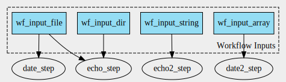

# Scenario 4

Analysis the representation of `String`, `File`, `Directory` and `File array` input parameter values AND `ResourceRequirement` in `ro-crate-metadata.json`. 



Workflow with 4 inputs of type string, File, File array, and Directory. 1 CommandLineTool has a `ResourceRequirement` ([#L13](./rocrate/packed.cwl)).

- Create workflow graph: `cwltool --print-dot wf.cwl | dot -Tsvg > wf_graph.svg`
- Create CWLProv RO: `cwltool --provenance ./ro wf.cwl wf_job.yml`
- Convert to ROCrate: `runcrate convert ./ro --output ./rocrate`

This produces a warning, but the RO-crate is still created:

```
Entity wf:main/date2_step_2 not found in Provenance<urn:uuid:a5d9245c-e21c-4898-9bf7-468e7092af1f from /Users/r.d.wit/Documents/GitHub/runcrate-analysis/scenario4_a/ro/metadata/provenance/primary.cwlprov.xml>
```

## ResourceRequirement

- `ramMin`: [#L211](./rocrate/ro-crate-metadata.json)
- `coresMin`: not in `ro-crate-metadata.json`.

## Representation of input parameter values

- All inputs are mapped to their input parameters via `exampleOfWork`. ([#L417, #L427, etc](./rocrate/ro-crate-metadata.json)).
- File: Listed in `ro-crate-metadata.json` as `File`.
- String: Listed in `ro-crate-metadata.json` as `Text`. 
- Directory: Listed in `ro-crate-metadata.json` as `Dataset` and linked to the files it contains via `hasPart`.
- File array: Listed in `ro-crate-metadata.json` as `File`, `multipleValues=TRUE` and linked to the files it contains via `values`.