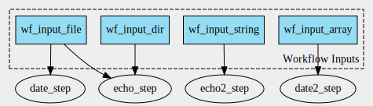

# Scenario 4



Workflow with 4 inputs of type string, File, File array, and Directory. 1 CommandLineTool has ResourceRequirements.

- Create workflow graph: `cwltool --print-dot wf.cwl | dot -Tsvg > wf_graph.svg`
- Create CWLProv RO: `cwltool --provenance ./ro wf.cwl wf_job.yml`
- Convert to ROCrate: `runcrate convert ./ro --output ./rocrate`

This produces an error:

```
(venv) (base) MacBook-van-Renske:scenario4 renskedewit$ runcrate convert ./ro --output ./rocrate
Traceback (most recent call last):
  File "/Users/renskedewit/Documents/GitHub/runcrate/venv/bin/runcrate", line 8, in <module>
    sys.exit(cli())
  File "/Users/renskedewit/Documents/GitHub/runcrate/venv/lib/python3.9/site-packages/click/core.py", line 1130, in __call__
    return self.main(*args, **kwargs)
  File "/Users/renskedewit/Documents/GitHub/runcrate/venv/lib/python3.9/site-packages/click/core.py", line 1055, in main
    rv = self.invoke(ctx)
  File "/Users/renskedewit/Documents/GitHub/runcrate/venv/lib/python3.9/site-packages/click/core.py", line 1657, in invoke
    return _process_result(sub_ctx.command.invoke(sub_ctx))
  File "/Users/renskedewit/Documents/GitHub/runcrate/venv/lib/python3.9/site-packages/click/core.py", line 1404, in invoke
    return ctx.invoke(self.callback, **ctx.params)
  File "/Users/renskedewit/Documents/GitHub/runcrate/venv/lib/python3.9/site-packages/click/core.py", line 760, in invoke
    return __callback(*args, **kwargs)
  File "/Users/renskedewit/Documents/GitHub/runcrate/src/runcrate/cli.py", line 56, in convert
    builder = ProvCrateBuilder(root, workflow_name, license)
  File "/Users/renskedewit/Documents/GitHub/runcrate/src/runcrate/__init__.py", line 180, in __init__
    self.step_maps = self._get_step_maps(self.cwl_defs)
  File "/Users/renskedewit/Documents/GitHub/runcrate/src/runcrate/__init__.py", line 202, in _get_step_maps
    rval[k][f] = {"tool": get_fragment(s.run), "pos": pos_map[f]}
  File "/Users/renskedewit/Documents/GitHub/runcrate/src/runcrate/__init__.py", line 111, in get_fragment
    return uri.rsplit("#", 1)[-1]
AttributeError: 'CommandLineTool' object has no attribute 'rsplit'
```

This error can be resolved by defining the CommandLineTool executed in `date2_step` in a separate file, see [scenario4_b](../scenario4_b). 