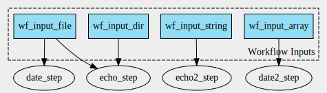

# Scenario 4



Workflow with 4 inputs of type string, File, File array, and Directory. 1 CommandLineTool has ResourceRequirements. 

**In contrast to [scenario4_a](../scenario4_a), here the CommandLineTool executed in `date2_step` is defined in a separate file.**

- Create workflow graph: `cwltool --print-dot wf.cwl | dot -Tsvg > wf_graph.svg`
- Create CWLProv RO: `cwltool --provenance ./ro wf.cwl wf_job.yml`
- Convert to ROCrate: `runcrate convert ./ro --output ./rocrate`

This produces a warning, but a ROCrate is still created:

```
(venv) (base) MacBook-van-Renske:scenario4_b renskedewit$ runcrate convert ./ro --output ./rocrate
Entity wf:main/date2_step_2 not found in Provenance<urn:uuid:dc6494c4-8b0b-44a1-8e3c-bd82f0469524 from /Users/renskedewit/Documents/GitHub/runcrate-analysis/scenario4_b/ro/metadata/provenance/primary.cwlprov.xml>
```

# Commit [7c77b0dabe45e60a2cb87d8320a5c1df592fb477](https://github.com/ResearchObject/runcrate/commit/4e69222e9489da5fe4f16d94a97a2242e2b3009d)

Rerun conversion step: `runcrate convert ./ro --output ./rocrate_v2`

Same warning:

```
(venv) (base) MacBook-van-Renske:scenario4_b renskedewit$ runcrate convert ./ro --output ./rocrate_v2
Entity wf:main/date2_step_2 not found in Provenance<urn:uuid:dc6494c4-8b0b-44a1-8e3c-bd82f0469524 from /Users/renskedewit/Documents/GitHub/runcrate-analysis/scenario4_b/ro/metadata/provenance/primary.cwlprov.xml>
```
